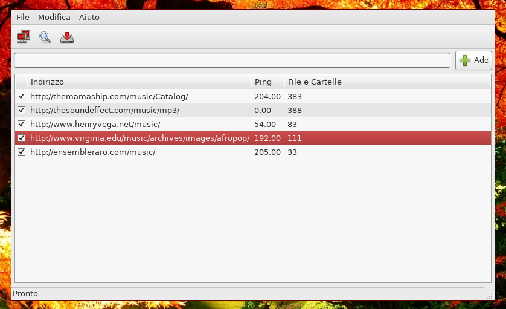
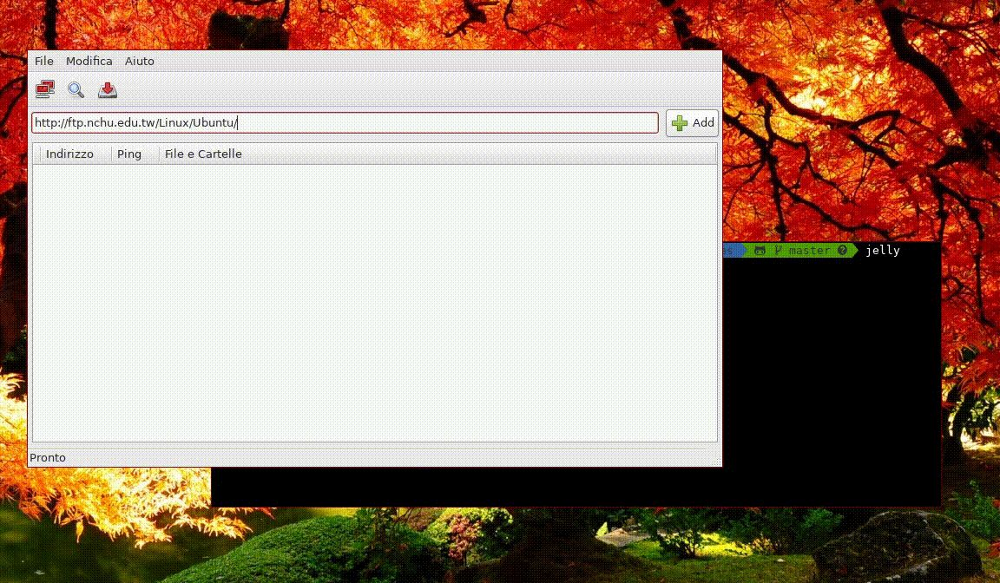
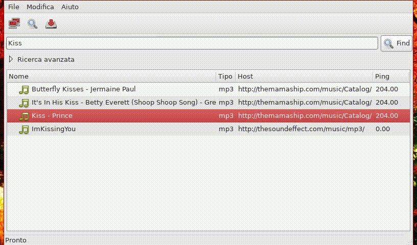

# 2009 - Jellyfish (memories from my past)

A Web Scraper / File Downloader.

I was 19 years old at the time, Internet was still damn slow for enjoying P2P networks,
and I started looking for different strategies to download music and movies.

This project uses a specific web scraper to exploit misconfigured Apache servers which
allow directory listing.

## Technologies

* gtkmm-2.4       - http://www.gtkmm.org/
* cURL (>= 7.18)  - http://curl.haxx.se/
* pcre++ (>= 0.9) - http://www.daemon.de/PCRE
* zlibc (>= 0.9)  - http://zlibc.linux.lu/

## Screenshots

You can find the other screenshots in the directory [/doc](doc/).
